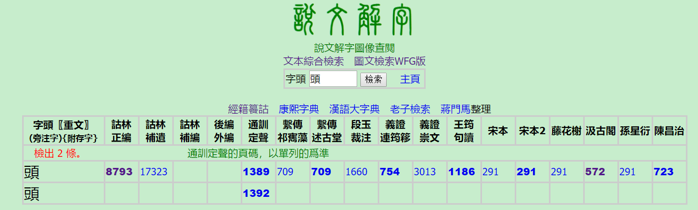

# 汉字字形、构件网站调研
*整理：方雪至、崔悦、谢永慧*
## *小学堂*
### 网址
> http://xiaoxue.iis.sinica.edu.tw/
### 收录现况
|字形|字数/笔数|
|----|----|
|**甲骨文**|24701|
|**金文**|23836|
|**战国文字**|70557|
|**小篆**|11101|
|**楷书**|91850|

### 基本信息
- 优点
    - 台湾地区政府资助，资源丰富
    - 操作界面简洁易用
        

    - 有高阶检索模式
        

    - 可以按部件检索未编码的字或生僻字
        

    - 在搜索框内按F1可以看到该栏详细的使用说明
- 缺点
    - 需要翻墙

    - 不支持简体输入查询
        

### 补充：*国际电脑汉字及异体字知识库*
> http://chardb.iis.sinica.edu.tw/
- 基本查询

    

    - 支持简体/繁体
    - 给出字义、读音、部首、总笔数等信息

- 可以查看字形演变信息
    

- 可以查到汉字编码信息  
    

## *字源*
### 网址
> https://hanziyuan.net/
### 缺点
- 收录的《甲骨文编》和《金文编》很多漏释、误释的成份，已经不太适合今天的古文字学研究。
- 缺少战国简帛文字
- 检索系统缺少持续维护，某些结果有明显错误。
## 汉典
### 网址
> https://www.zdic.net/

### 基本信息

- 字形较少
- 部分字头放错
- 部分小篆字形是现代生成的字体
## *中华语文知识库*
### 网址
> http://chinese-linguipedia.org/
### 收录
- 常用字3000
### 基本信息

- 优点：
    - 支持部首查询/繁体字查询
    - 提供不同时期的汉字形体及**动态笔顺**演示
    - 标明了列出的汉字字形的出处
    - 有对字源本义的简约解释
- 缺点：
    - 网站加载速度慢
    - 不支持简体字查询

## *汉语多功能字库*
### 网址
>　http://humanum.arts.cuhk.edu.hk/Lexis/lexi-mf/
### 收录概况

### 制作单位
- 香港中文大學人文電算研究中心
### 基本信息
- 收录了不同时期汉字形体
- 支持简/繁输入
- 提供汉字编码信息
- 提供甲骨文和金文的部件表
    

- 部分甲骨文及金文有部件树结构
    

## *汉字全息资源应用系统*
### 网址
> https://qxk.bnu.edu.cn/
### 制作单位
- 北京师范大学汉字研究与现代应用实验室
### 收录概况
- 字符总集：81722
- 古籍印刷通用字集：16490
- 现代通用规范字集：8105
- 常用字集：3500
- 历代图形字集: 16489
### 基本信息
- 加载速度快
- 形、音、义三个平面分析
- 提供历代汉字字形（清晰度不高）
- 提供**构形模式**、**造字方法**及**构件拆分**  
    

## *楚简帛字典[清华篇]*
### 网址
> http://cjbnet.org/qinghua/#
### 收录现况
- 收录篇数为45篇，共27168个字。每字下列有小篆形体及清华简原图。
### 基本信息
- 优点
    - 是目前公开的楚简资料库中收录《清华简》最完整的
    - 操作界面简洁易用
        
        

    - 检索出的字包含有其在文中出现的次数、小篆形体、原图版字形及所在原文，原图可下载保存
        
        

- 缺点
    - 不支持简体输入查询
## *国学大师*   
###  网址
> http://www.guoxuedashi.com/
### 收录现况
|查询方式|收录字数|
|----|----|
|**部件查询**|20万|
|**书法字典+字体转换器+篆书识别器**|9834|
### 基本信息
- 功能
  - 按照部件查字
    - 可以根据肉眼将汉字拆分成常用部件，输入到查询框，即可找到相应汉字。
    - 当输入的构件是简体时，要选择兼容模式；也可通过输入图片字进行查询。
  - 按照结构精确查询
    - 首先选择汉字结构，然后按照结构，严格输入。
  - 按照笔画数及每个字的前几笔进行查询
       

  
  - 也可查询汉字形体的演变及古音和意义。
             

       

##  *说文解字综合检索系统*
### 网址
> http://www.homeinmists.com/shuowen/
### 收录范围
- 文本版：《說文解字》、《經籍䉵詁》、《康熙字典》、《汉语大字典》、《老子》
- 图版
《說文解字詁林》丁福保編輯。
《說文通訓定聲》清朱駿聲撰。
《說文解字繫傳》兩種：五代時南唐徐鍇撰，《四部叢刊》景印述古堂景宋寫本、華文書局影印道光十九年依景宋鈔本重彫的祁寯藻刻本。
《說文解字注》：清段玉裁注，有經韻樓本、兩宜軒本(未見)。
《說文解字義證》兩種：清桂馥撰，連筠簃叢書本、崇文書局覆刻本。
《說文解字句讀》：清王筠撰，《續修四庫全書》本，附錄《補正》。
《說文解字》宋本：徐鉉、句中正、葛湍、王惟恭於宋太宗雍熙三年(986)奉敕校訂，《續古逸叢書》和《四部叢刊》影印本，青浦王昶(蘭泉)所藏宋小字本，今藏日本巖崎氏靜嘉堂。
《說文解字》藤花榭本：清嘉慶丁卯年(1807)額勒布據新安鮑惜分家藏宋本翻刻，仿北宋小字本。
《說文解字》汲古閣本：明毛晉毛扆父子據北宋本校刊，汲古閣藏板，錢恂舊藏。
《說文解字》孫星衍本：嘉慶甲子歲(1809)仿宋刊本，五松書屋臧，平津館叢書原刻本。
《說文解字》陳昌治本：據孫星衍本重刻。
《說文解字五音韻譜》十二卷：南宋李燾、賈端修輯。
《說文字原集註》：清蔣和撰。
《說文字原考略》：清吳照南撰。
《說文提要》：清陳建侯撰。
### 基本信息
- 功能
  - 文本综合检索：可通过字头、部首、字号、解说、反切、拼音、注音检索汉字，检索出的汉字列出了小篆形体。
       

   

  - 图像查阅：通过字头检索汉字，检索出的汉字列出了上述数目所在页的页码和图片。
       

  
 
  - 图文检索：通过字头或解说检索，可得到该字部首、注音、拼音、卷别及在大徐本、小徐本、段注本上的形体及解释；也可得到该字所处页的图片。

       

  
       

 
       

 

- 优点
  - 内容丰富，信息全面，可靠性强
  - 操作界面简单
- 缺点
  - 不支持简体输入

##  *引得市*
### 网址链接
> http://www.mebag.com/index/

### 网站特色
- 主要语料取自古文字相關字典索引資料
    - 能够提高书籍的检索速度，便于高效查找信息
- 全方面搜集了古文字领域最全面的常用书
    - 包括《新甲骨文编》、《甲骨文字编》、《甲骨文字诂林》、《甲骨文字诂林补编》、《新金文编》、《清华简》《上博简》各地简帛的文字编等书的索
- 以检字表性质的索引较多
### 操作指南
- 安装字体
- 检索容易输入的汉字
- 检索不容易输入的汉字
    - 使用部件检索功能 

       

 

       然后

        

- 检索「部件检索」找不到的字
    - 使用古文字缺字资料库（本网站最大的特点）

        

        然后
         

